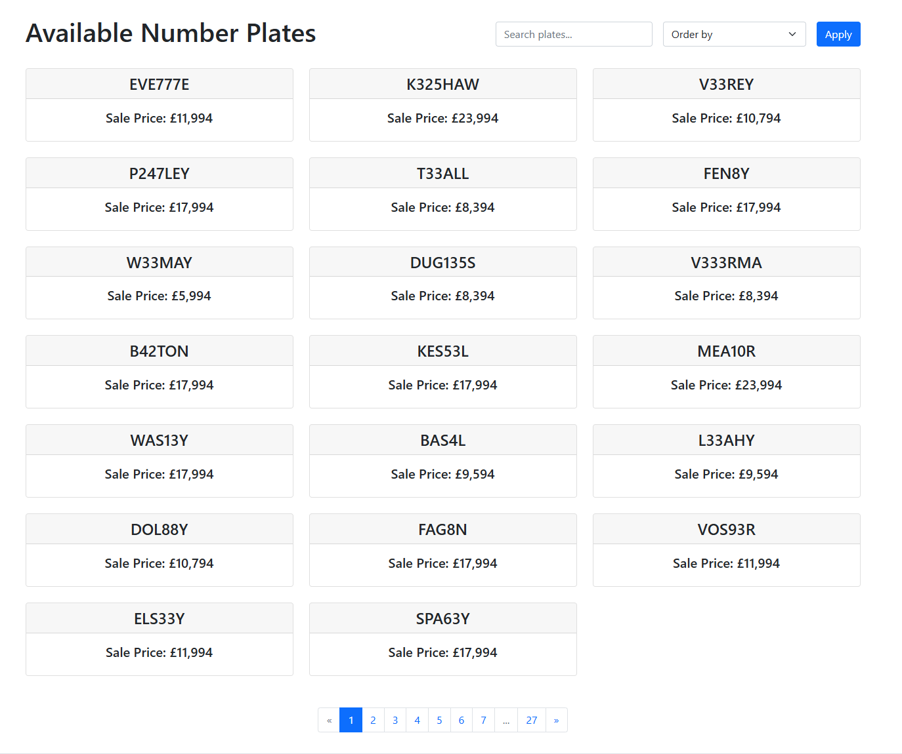
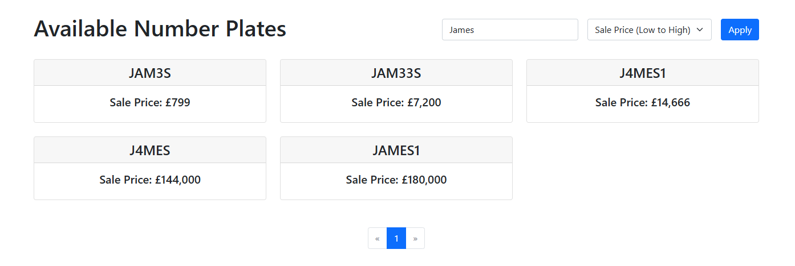
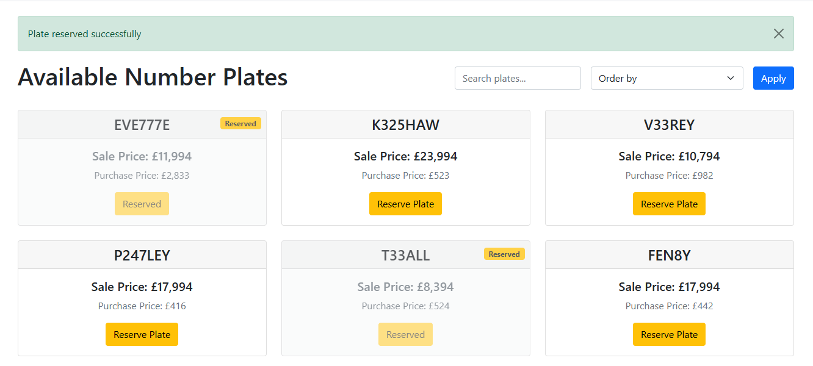
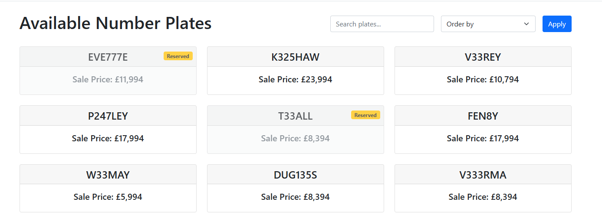
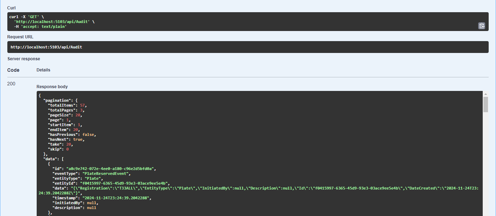
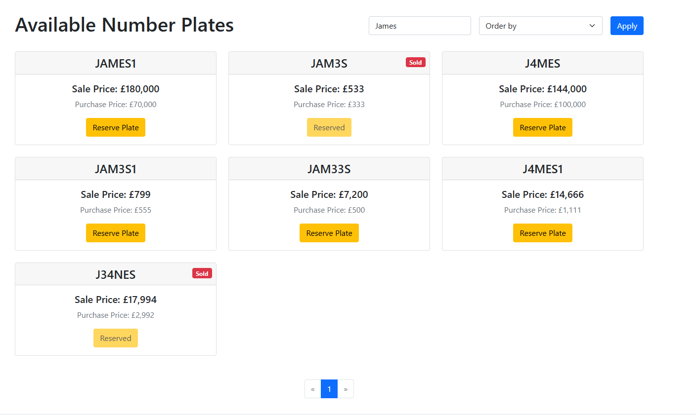
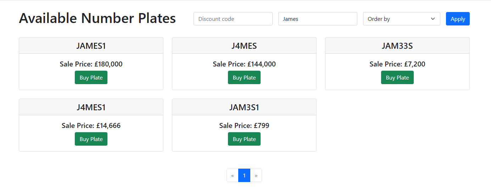
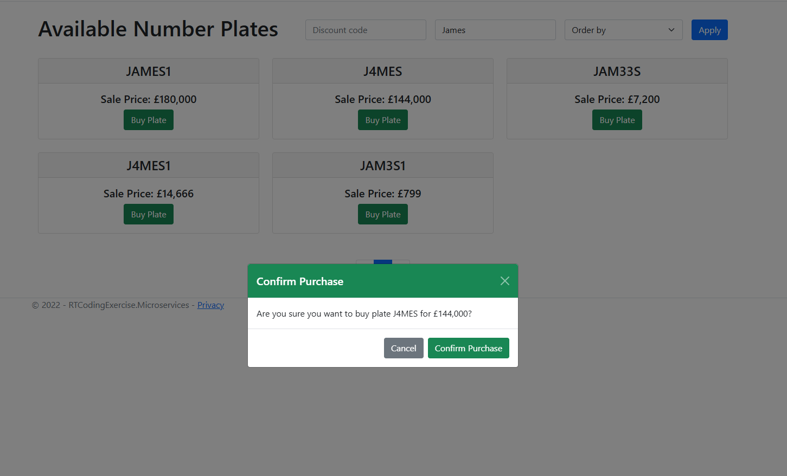
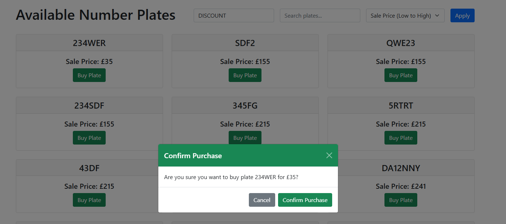
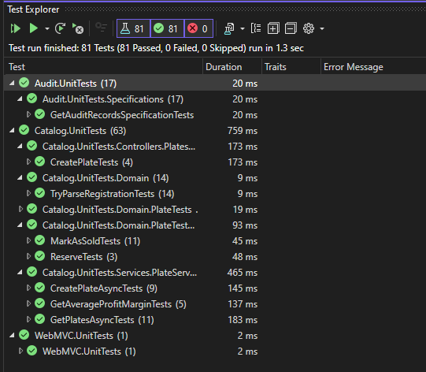

# RegTransfers Technical Test Solution

## Architecture Overview

[](https://mermaid.live/edit#pako:eNqdlE1LAzEQhv9KiBeFFhRbpREEay8eCmoFQdfDJJltI9lNm49KKf3vZs3WYovb0uwlO_u-z0xmhyypMBIpo7k2X2IC1pOXflaSuFzgYwvTCXkGzpUfPqVwtYrZcrmOrlaMsQKdgzG2ZwEDJh2WMiu3SKOYAOWgvyFJ_n6aomQAHjg4PPuIQMl3KK_IH635ROHjd4d2rgSSdpsI0NrFzS15kFh65RdDJaypFRttM8XFTI7U50i4fadMwGZVhZao1RytIxZjzPlEvwsyWhoqPRZ8H_uozfg_dII3ZK_IFt3UVA2ZKzioFxWzMfFR1INqDa7-X_tmaW99B5OaB-1gVIIJDc4NMCdre660ZiedXq-DvEWE0cayk_xn3WxZ_o5EMl5eid61_DVe9Kpn2yh5rc5Bds-7u2raogXaApSMl8OycmfUT7DAjLK4lZhD0D6jWbmKUgjejBaloMzbgC1qTRhPKMtBu_gWphI8DhTEW6BYS6ZQvhlT1KLVN4BXiVY)

## Test Users Details
Admin User: (Gives access to add a plate, purchase prices and reservation function)
- Email: admin@regtransfers.co.uk
- Password: Password123*

Regular User: (Gives access to buy plates)
- Email: user@regtransfers.co.uk
- Password: Password123*

## Service Details
Web: http://localhost:5000/

Catalog: http://localhost:5001/

Identity: http://localhost:5002/

Audit: http://localhost:5003/

## Design Patterns & Principles

### Domain-Driven Design (DDD)
- Bounded contexts for each microservice
- Rich domain models with business logic encapsulation
- Domain events for cross-service communication

### Message-Driven Architecture
- Asynchronous communication via RabbitMQ
- Event-driven design
- Loose coupling between services

## Implementation Details

### WebMVC Project 
- Plate search, filter and sort functionality
- Login and registration interfaces
- Role-based access control

### Identity Microservice
- Handles authentication and authorization
- JWT token-based security

### Catalog Microservice
- Manages number plate inventory
- Handles plate reservations and purchases
- Implements business logic for pricing

### Audit Microservice
- Tracks system activities
- Handles financial reporting
- Provides analytics capabilities

## Pre-requisites

I made the decision to implement an Identity microservice so that we could have role-based access control to specific features of the site. This was necessary as several user stories required different functionality based on user roles - administrators needed access to purchase prices and the reservation function, while regular users needed a simpler interface to allow them to buy plates.

## User Stories Implementation

### User Story 1
- Implemented using MassTransit for communication between WebMVC and Catalog microservice
- HomeController handles the initial request
- Catalog microservice processes GetPlatesRequest via RabbitMQ
- Returns PagedResponse containing 20 plates per page
- View displays plates as bootstrap cards
- Role-based visibility ensures:
  - Admin users see purchase prices
  - All users see registration numbers

### User Story 2
- Extended PlatesFilter to handle sort parameters
- Added sort dropdown to the view interface
- Implemented two base sorting options:
  - Sale Price (Low to High)
  - Sale Price (High to Low)
- Role-based sort options:
  - Admin users see additional purchase price sorting
- Sort parameters handled through existing MassTransit pipeline
- Applied sorting at database level for efficiency

### User Story 3
- Implemented weighted search functionality combining multiple approaches:
  - Basic contains matching (30% weight)
  - Letters-only matching using Levenshtein (30% weight)
  - Full registration Levenshtein matching (20% weight) 
  - Normalized registration Levenshtein matching with character substitution (20% weight)

- Search scoring:
  - Each search method contributes to a combined score
  - Results must meet minimum threshold of 0.3 (30%)
  - Higher scores appear first in results

- Levenshtein distance:
  - Maximum allowed distance of 3 characters
  - Applied to both full registration and letters-only

- Character substitution:
  - Numbers replaced with common letter equivalents before Levenshtein calculation
  - Examples: '3'→'E', '4'→'A', '1'→'I', '5'→'S'
  - Helps match plates like "D4N" when searching for "DAN"

  
  
  

### User Story 4
- Implemented plate reservation system:
  - Added StatusId to Plate entity
  - Status visually indicated on plate cards with badges
  - Admin-only reserve functionality via button

- Reservation process:
  - Reserve action triggers ReservePlateCommand via MassTransit
  - Catalog service updates plate status
  - Publishes PlateReservedEvent to RabbitMQ
  - Audit service consumes event and logs action

- Audit trail implementation:
  - Audit microservice captures:
    - Plate details
    - Action performed
    - Timestamp
  - Stored in separate audit table for reporting

### User Story 5
- Modified GetPlatesSpecification to filter by status:
  - Added status check to base query
  - Non-admin users only see available plates
  - Admin users see both available and reserved plates

- Implementation approach:
  - Status filtering applied before any other filters
  - Integrated with existing search and sort functionality

- Role-based visibility:
  - Regular users: Clean view of only purchasable plates
  - Admin users: Full visibility for inventory management

### User Story 6
- Implemented plate purchase functionality:
  - Added buy button for regular users
  - Confirmation modal shows price and registration
  - Status updates to sold after purchase

- Purchase process:
  - BuyPlateCommand sent via MassTransit
  - Catalog service validates and processes purchase
  - Publishes PlateSoldEvent to RabbitMQ
  - Audit service logs transaction

- Revenue tracking:
  - Queries audit service for PlateSoldEvents
  - Calculates total revenue from sale prices
  - Displayed at top of page

- Profit margin calculation:
  - Sale price (inc VAT) converted to ex VAT
  - Compared against purchase price (ex VAT)
  - Percentage margin calculated and displayed
  - Implemented as separate endpoint for efficiency

[Screenshot: Buy confirmation modal]
[Screenshot: Revenue and profit margin display]

### User Story 7
- Implemented discount system using DDD principles:
  - Created Price value object to encapsulate pricing logic
  - Business rules enforced within domain
  - Discount calculations handled in domain layer

- Discount types implemented in Price value object:
  - Fixed amount (£25 off with code "DISCOUNT")
  - Percentage based (15% off with code "PERCENTOFF")
  - Designed to be extensible for future discount codes

- Implementation approach:
  - Domain-driven design keeps business logic in domain layer
  - Price calculations encapsulated
  - Discount code passed through MassTransit pipeline

### User Story 8
- Enhanced Price value object with validation:
  - Added minimum price threshold (90% of sale price)
  - Validation occurs before purchase completion
  - Custom exceptions for clear error messaging

- Validation process:
  - Checks if discounted price would fall below threshold
  - Calculates minimum allowed price (90% of original)
  - Throws DiscountExceedsMinimumPriceException if invalid
  - Returns friendly error message to user

- Implementation approach:
  - Validation logic contained within Price value object
  - Consistent with DDD principles
  - Maintains business rule integrity in domain layer

## Testing Overview
- 81 unit tests implemented using:
  - xUnit as testing framework
  - Moq for mocking dependencies
  - Bogus for test data generation
  - FluentAssertions for readable assertions

## Thoughts and Future Improvements

The current search implementation, while functional for the exercise, would not be optimal at scale. Moving to a dedicated search solution like Elasticsearch would provide better performance and more sophisticated text analysis capabilities when dealing with large datasets.

While the current MVC implementation is functional, rebuilding the frontend in Angular would offer significant benefits including better state management and type safety with TypeScript.

The UI/UX could be modernized with improved responsive design, loading states, and better error handling.

Several technical improvements could be made including implementing a caching strategy, implementing OpenTelemetry, implementing circuit breakers with Polly, and considering separate databases per service.

The testing suite could be expanded beyond unit tests to include integration tests, end-to-end testing, and performance testing.
